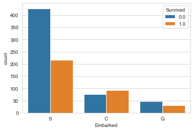

# Titanic Dataset

## Dataset Description

### O desafio

O naufrágio do Titanic é um dos naufrágios mais infames da história. Em 15 de abril de 1912, durante sua viagem inaugural, o RMS Titanic, amplamente considerado “inafundável”, afundou após colidir com um iceberg. Infelizmente, não havia botes salva-vidas suficientes para todos a bordo, resultando na morte de 1.502 dos 2.224 passageiros e tripulantes.

Embora houvesse algum elemento de sorte envolvido na sobrevivência, parece que alguns grupos de pessoas tinham maior probabilidade de sobreviver do que outros. Neste desafio, pedimos-lhe que construa um modelo preditivo que responda à pergunta: "que tipos de pessoas têm maior probabilidade de sobreviver?" usando dados de passageiros (ou seja, nome, idade, sexo, classe socioeconômica, etc.).

Os dados foram divididos em dois grupos:

- Conjunto de treinamento (train.csv)
- Conjunto de testes (test.csv)

O conjunto de treinamento deve ser usado para construir seus modelos de aprendizado de máquina. Para o conjunto de treinamento, fornecemos o resultado (também conhecido como “verdade básica”) para cada passageiro. Seu modelo será baseado em “características” como gênero e classe dos passageiros. Você também pode usar a engenharia de recursos para criar novos recursos.

O conjunto de testes deve ser usado para ver o desempenho do seu modelo em dados não vistos. Para o conjunto de testes, não fornecemos informações básicas para cada passageiro. É seu trabalho prever esses resultados. Para cada passageiro no conjunto de teste, use o modelo que você treinou para prever se eles sobreviveram ou não ao naufrágio do Titanic.

Também incluímos género_submission.csv, um conjunto de previsões que assumem que todas as passageiras, e apenas as mulheres, sobrevivem, como um exemplo de como deve ser o aspecto de um ficheiro de submissão.

### Nomes das colunas

- 1. 'PassengerId'
- 2. 'Survived'
- 3. 'Pclass'
- 4. 'Name'
- 5. 'Sex'
- 6. 'Age'
- 7. 'SibSp'
- 8. 'Parch'
- 9. 'Ticket'
- 10. 'Fare'
- 11. 'Cabin'
- 12. 'Embarked'

### Dados do dicionário

- **survival**: Survival (0 = No, 1 = Yes)
- **pclass**: Ticket class (1 = 1st, 2 = 2nd, 3 = 3rd)
- **sex**: Sex
- **age**: Age in years
- **sibsp**: # of siblings / spouses aboard the Titanic
- **parch**: # of parents / children aboard the Titanic
- **ticket**: Ticket number
- **fare**: Passenger fare
- **cabin**: Cabin number
- **embarked**: Port of Embarkation (C = Cherbourg, Q = Queenstown, S = Southampton)

### Notas das variáveis

- **pclass**: A proxy for socio-economic status (SES) (1st = Upper, 2nd = Middle, 3rd = Lower)
- **age**: Age is fractional if less than 1. If the age is estimated, it is in the form of xx.5
- **sibsp**: The dataset defines family relations (Sibling = brother, sister, stepbrother, stepsister; Spouse = husband, wife)
- **parch**: The dataset defines family relations (Parent = mother, father; Child = daughter, son, stepdaughter, stepson). Some children traveled only with a nanny, therefore parch=0 for them.

## Insights iniciais

### Durante a análise inicial:

- O conjunto de dados indica que sobreviveram mais mulheres do que homens, com 100% de sobrevivência para as mulheres nos dados originais.
- Pessoas da 3ª classe sofreram o maior número de vítimas.
- A coluna ‘Idade’ pareceu ser a mais correlacionada com a classe do passageiro.
- Na coluna ‘Tarifa’ só faltava um valor, sendo que este passageiro, segundo os dados, pertencia à 3ª classe.
- Analisando a coluna ‘Embarcados’, a maior parte das pessoas que embarcaram em ‘S’ não sobreviveram, sendo que apenas 33,69% delas sobreviveram.
- Na coluna ‘Embarcados’ há apenas dois valores faltantes, e estes dois passageiros são da mesma cabine, B28.

## Variáveis categóricas
<table>
  <tr>
    <td></td>
    <td></td>
    <td></td>
    <td></td>
  </tr>
  <tr>
    <td></td>
    <td></td>
    <td></td>
  </tr>
</table>

## Variáveis numéricas
<table>
  <tr>
    <td></td>
    <td></td>
  </tr>
</table>

## Solução

- Uma das soluções escolhidas para este desafio foi pré-processar os dados em conjunto, criando uma coluna de teste separada, 'PassengerId', e fundindo os conjuntos de dados.
- Na coluna ‘Idade’ havia muitos valores ‘NaN’, então foi necessário transformar esses valores faltantes. Quando faltava uma idade específica, ela era substituída pela média de idade da classe do passageiro na coluna ‘Pclass’.
- As colunas ‘SibSp’ e ‘Parch’ representam os membros da família. Portanto, uma solução de análise foi criar uma nova coluna chamada ‘FamilySize’ para combinar o número total de pessoas em uma única coluna, incluindo o passageiro e seus acompanhantes das duas colunas.
- A coluna 'Ticket' não foi adicionada ao novo dataframe devido à falta de um padrão consistente.
- A coluna 'Cabin' não foi adicionada ao novo dataframe porque tinha muitos valores faltantes, embora existissem padrões de numeração para cabines, com apenas 0,007% de valores válidos.
- Na coluna ‘Nome’, foi criada uma nova coluna chamada ‘Título’ para categorizar os nomes por títulos (por exemplo, Sr., Senhorita, Mestre, etc.).
- Para modelagem, foram testados oito modelos: 'Random Forest Classifier', 'Logistic Regression', 'K-Nearest Neighbors', 'Gaussian Naive Bayes', 'Linear Support Vector Machine (SVC),' 'Stochastic Gradient Descent,' ' Classificador de árvore de decisão' e 'Árvores de aumento de gradiente'. Embora alguns modelos não tenham produzido resultados aparentes, foram testados como prática para fins de aprendizagem.
- O método 'GridSearchCV' foi usado na seção 'Get Params' para ajuste de hiperparâmetros.

## Importante
- Esse é um dataset de estudo, usado para fins acadêmicos, podendo ser melhorado e alterado com o tempo.

## Referências

- [Great Learning](https://www.mygreatlearning.com/blog/gridsearchcv/)
- [Kaggle](https://www.kaggle.com/competitions/titanic/data)
- Kaggle Challenge: Titanic - Machine Learning - [Part 1](https://www.youtube.com/watch?v=8Fu-jBoPci0) & [Part 2](https://www.youtube.com/watch?v=4ryDV7EUtlU&list=PLTrMTWH_kmG_sapE9vb57IzsqAsUV7Xtz&index=2)
